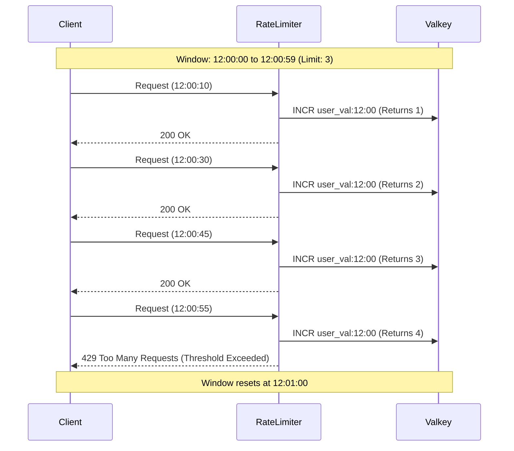

# Fixed Window Counter

The **Fixed Window Counter** algorithm divides time into discrete, contiguous, non-overlapping windows (e.g., 1 minute from 12:00:00 to 12:00:59, then 12:01:00 to 12:01:59). A counter maps to each window, and requests increment the counter for the *current* window.

## How It Works

1.  Divide the timeline into fixed-size time windows (e.g., 60 seconds).
2.  Assign a counter to each window.
3.  On receiving a request, identify the current window based on the timestamp and increment its counter.
4.  If the counter exceeds the threshold, the request is dropped.
5.  When the time window expires, the counter resets.

### Diagram



## Pros and Cons

*   **Pros:**
    *   Very memory efficient (only stores one integer per user per window).
    *   Simple to understand and implement.
    *   Fast execution (a single `INCR` operation in Valkey/Redis).
*   **Cons:**
    *   **The "Edge Problem" (Bursting at boundaries):** A spike in traffic at the edges of a window can allow a user to make double the allowed requests in a short time. For example, if the limit is 10/min, 10 requests at 12:00:59 and 10 requests at 12:01:01 will both succeed, resulting in 20 requests in a 2-second period.

## Code Example

This is the algorithm currently implemented in our API server using Valkey.

```python
import time
import valkey

def is_allowed(user_id: str, limit: int, window_in_seconds: int, client: valkey.Valkey) -> bool:
    # 1. Determine the current fixed window bucket
    current_time_bucket = int(time.time() // window_in_seconds)
    
    # 2. Formulate the key
    redis_key = f"rate_limit:{user_id}:{current_time_bucket}"
    
    # 3. Increment the counter
    pipeline = client.pipeline()
    pipeline.incr(redis_key)
    # Set TTL slightly longer than window to ensure self-cleanup
    pipeline.expire(redis_key, window_in_seconds + 10)
    
    result = pipeline.execute()
    request_count = result[0]
    
    # 4. Check against the limit
    return request_count <= limit
```
