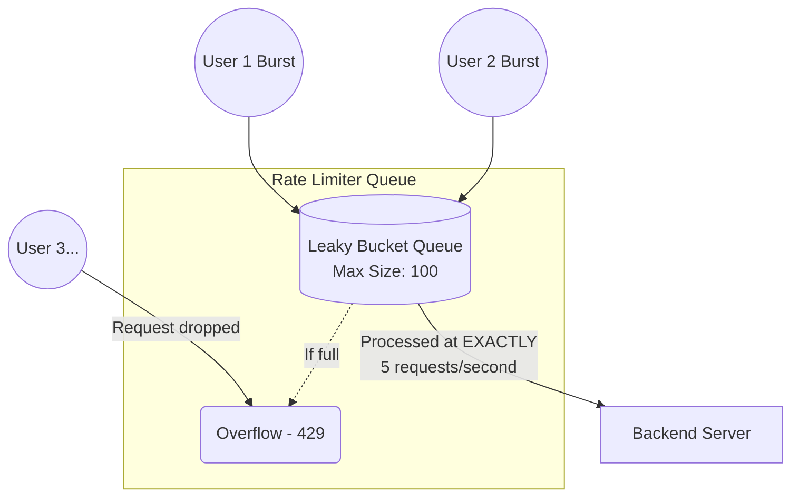

# Leaky Bucket

The **Leaky Bucket** algorithm is similar to the Token Bucket but focuses on a steady, constant outbound processing rate. Instead of directly controlling how fast requests are *accepted* (via tokens), it acts as a queue: requests fill up the bucket, and the server processes them (leaks them) at a fixed, constant rate.

## How It Works

1.  Imagine a bucket with a hole at the bottom.
2.  Incoming requests are added to the bucket (a queue).
3.  If the bucket is full (the queue has reached its maximum size), new incoming requests are dropped (overflow).
4.  The server processes the items in the bucket at a strictly constant rate (e.g., 5 requests per second).

*(Note: Leaky bucket is incredibly useful for smoothing out explosive traffic spikes into a steady stream of work for backend workers).*

### Diagram



## Pros and Cons

*   **Pros:**
    *   **Smooth traffic:** Completely neutralizes sudden bursts of traffic. The backend server is absolutely guaranteed to never process more than exactly `X` requests per second.
    *   **Protects sensitive backends:** Perfect for rate limiting access to legacy systems, databases, or third-party APIs that will outright crash under load.
*   **Cons:**
    *   **No immediate bursts:** Unlike token buckets, users cannot burst their requests. The requests are strictly processed at the leak rate. This can increase latency for users during a "burst" because their request sits in the queue longer.
    *   **Implementation complexity:** Usually requires an actual asynchronous queue (like RabbitMQ, Celery, or Redis Lists) rather than a simple counter.

## Code Example

Implementation conceptualization using a fast asynchronous queue (unlike previous examples which returned immediately, this example enqueues):

```python
# Conceptual pseudocode using a Queue
import valkey
import time

QUEUE_MAX_SIZE = 100
PROCESS_RATE_PER_SEC = 5

def enqueue_request(request_data: dict, client: valkey.Valkey) -> bool:
    queue_key = "rate_limit:leaky_bucket:global_queue"
    
    # Get current queue length
    queue_length = client.llen(queue_key)
    
    if queue_length >= QUEUE_MAX_SIZE:
        # Bucket is over-filled, drop request
        return False
        
    # Add to the queue (the bucket)
    client.rpush(queue_key, str(request_data))
    return True

# ---------------------------------------------
# Background Worker Process (The "Leak")
# ---------------------------------------------
def worker_process(client: valkey.Valkey):
    while True:
        # Sleep to enforce the exact processing rate (1/5th second)
        time.sleep(1.0 / PROCESS_RATE_PER_SEC)
        
        # Pop from left
        request_string = client.lpop("rate_limit:leaky_bucket:global_queue")
        
        if request_string:
            # Process the actual work
            process_request_data(request_string)
```
