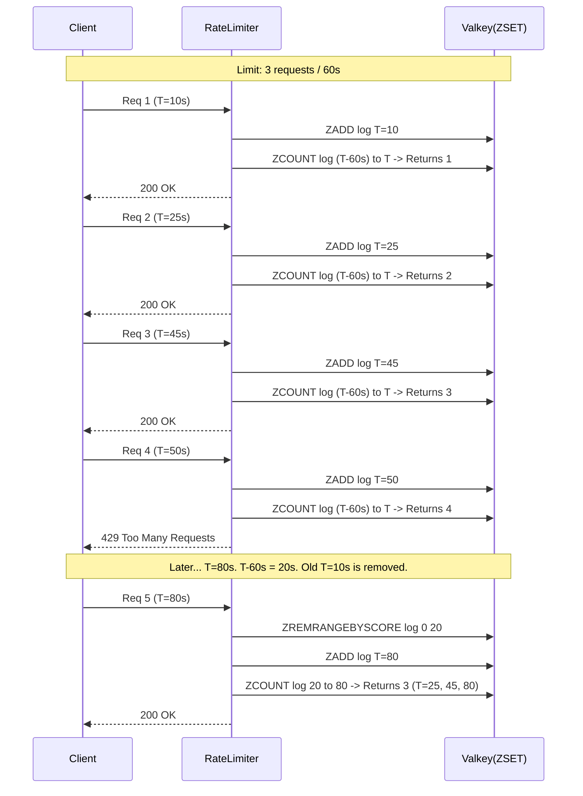

# Sliding Window Log

The **Sliding Window Log** algorithm resolves the "boundary effect" problem of the Fixed Window Counter. Instead of keeping a single count per window, it tracks the exact timestamp of every request. When a new request arrives, it evaluates the total number of requests that occurred strictly within the rolling time window.

## How It Works

1.  Maintain a log of request timestamps for each user.
2.  When a new request arrives at time `T`, remove all timestamps older than `T - window_size`.
3.  Add the new timestamp `T` to the log.
4.  If the number of entries in the log exceeds the limit, reject the request. Otherwise, accept it.

### Diagram



## Pros and Cons

*   **Pros:**
    *   **Extremely accurate:** Completely eliminates the bursting issues seen at the edges of fixed windows. A user can never exceed the limit in *any* rolling window of constraints.
*   **Cons:**
    *   **High memory usage:** We must store every single timestamp for every user within the window. If the limit is 10,000 requests per hour, we must store 10,000 timestamps per user.
    *   **Higher computational cost:** We must sort and clean up older log entries frequently (although Redis/Valkey `ZSET` makes this relatively fast).
    *   **Storage of dropped requests:** Even if a request is dropped, its timestamp is usually added to the log to prevent an attacker from finding the limit and hovering just under it. This can consume memory rapidly during attacks.

## Code Example

Implementation using Valkey/Redis `ZSET` (Sorted Sets):

```python
import time
import valkey

def is_allowed(user_id: str, limit: int, window_in_seconds: int, client: valkey.Valkey) -> bool:
    now = time.time()
    window_start = now - window_in_seconds
    redis_key = f"rate_limit:log:{user_id}"
    
    pipeline = client.pipeline()
    # 1. Remove all old requests outside the current sliding window
    pipeline.zremrangebyscore(redis_key, 0, window_start)
    
    # 2. Add the current timestamp (use timestamp as score and value to make it unique)
    # Be careful of exactly identical timestamps in high concurrency; append UUID if needed.
    pipeline.zadd(redis_key, {str(now): now})
    
    # 3. Count remaining elements
    pipeline.zcard(redis_key)
    
    # 4. Set TTL to keep Redis clean (optional, but good practice)
    pipeline.expire(redis_key, window_in_seconds + 10)
    
    results = pipeline.execute()
    request_count = results[2]  # The result of the zcard operation
    
    return request_count <= limit
```
