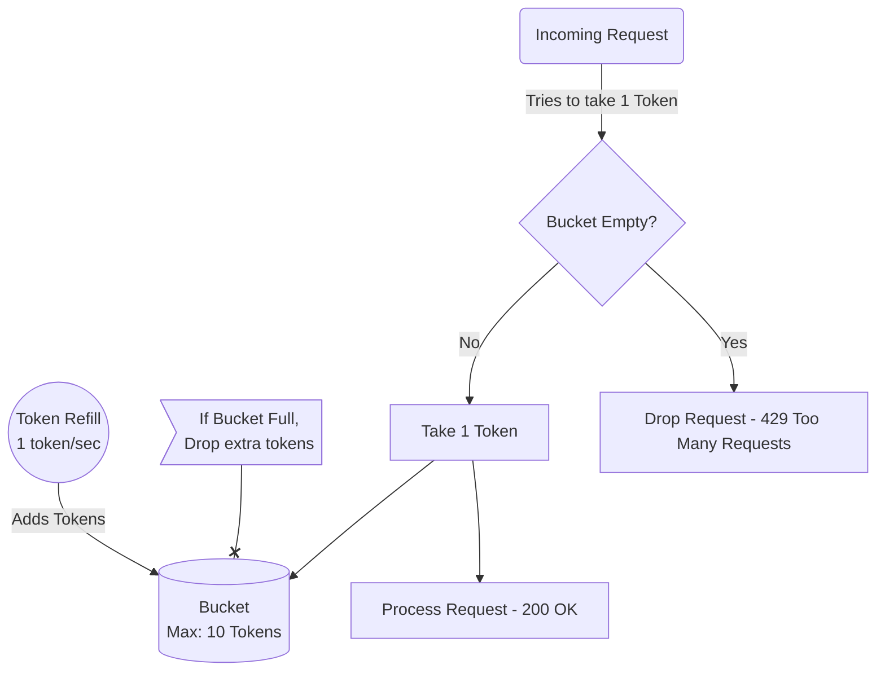

# Token Bucket

The **Token Bucket** algorithm assigns a bucket per user that holds a maximum number of "tokens." Each request consumes a token. Tokens are added back to the bucket at a constant rate over time. If a user has no tokens left, their request is dropped.

## How It Works

1.  A token bucket has a defined maximum capacity (e.g., `10 tokens`).
2.  Tokens are added to the bucket at a constant fill rate (e.g., `1 token per second`). The total tokens never exceed the maximum capacity.
3.  When a request comes in:
    *   If there are enough tokens (usually 1), a token is removed, and the request is successfully processed.
    *   If the bucket is empty (0 tokens), the request is dropped with a `429 Too Many Requests` status code.

### Diagram



## Pros and Cons

*   **Pros:**
    *   **Allows for Bursts:** Unlike fixed windows, if you haven't used your API for a while, your bucket fills up to the maximum capacity. You can then spend all 10 tokens at once (burst).
    *   **Memory Efficient:** Requires storing only the timestamp of the last refill and the current token count.
*   **Cons:**
    *   **Requires background calculation or 'lazy' filling:** Continuously filling the bucket with a background process is slow and resource-heavy. Instead, we typically fill the bucket lazily *at the moment of the request* by comparing the current timestamp with the last updated timestamp.

## Code Example

A common Redis implementation using Lua scripting or pipelining (Lazy Fill):

```python
import time
import valkey

def is_allowed(user_id: str, capacity: int, fill_rate_per_sec: float, client: valkey.Valkey) -> bool:
    redis_key = f"rate_limit:tb:{user_id}"
    now = time.time()
    
    # 1. Fetch current tokens and last timestamp
    results = client.hmget(redis_key, ["tokens", "last_updated"])
    
    if results[0] is None:
        # First time user: assign max tokens and process
        current_tokens = capacity - 1
        client.hmset(redis_key, {"tokens": current_tokens, "last_updated": now})
        client.expire(redis_key, int(capacity / fill_rate_per_sec) + 10)
        return True
        
    current_tokens = float(results[0])
    last_updated = float(results[1])
    
    # 2. Lazily calculate how many tokens have been added since last request
    time_passed = now - last_updated
    tokens_to_add = time_passed * fill_rate_per_sec
    
    # 3. Add to bucket, up to the maximum capacity
    current_tokens = min(capacity, current_tokens + tokens_to_add)
    
    # 4. Check if we have at least 1 token to spend
    if current_tokens >= 1:
        current_tokens -= 1
        # Atomic set is technically needed in production (via Lua script) to avoid race conditions
        client.hmset(redis_key, {"tokens": current_tokens, "last_updated": now})
        return True
        
    return False
```
