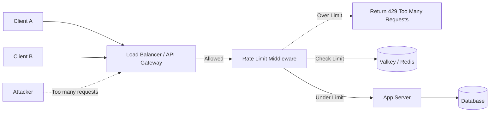

# Rate Limiting: A Comprehensive Guide

Welcome to the Rate Limiting Documentation! This repository serves as a study guide and practical implementation reference for understanding various rate limiting algorithms.

## What is Rate Limiting?

Rate limiting is a technique used to control the rate of requests sent to a network API or service. It helps protect the underlying services from being overwhelmed by too many requests, whether they come from legitimate spikes in traffic, misconfigured clients, or malicious attacks like DDoS (Distributed Denial of Service) and brute-force attempts.

### Why is it Important?

*   **Preventing Resource Starvation:** Ensures your servers always have enough resources (CPU, Memory, DB connections) to handle legitimate requests.
*   **Security:** Mitigates brute-force attacks (e.g., password guessing) and DDoS attacks.
*   **Fair Usage:** Prevents a single user or tenant from monopolizing the resources in a multi-tenant environment.
*   **Cost Management:** Controls auto-scaling costs by capping the maximum load the system will attempt to serve.

## High-Level Architecture

In a typical web application, rate limiting is implemented at an infrastructure layer (e.g., API Gateway, Load Balancer) or as a middleware within the application itself.

## Algorithms Covered in this Guide

This repository explores and documents the following common rate-limiting algorithms:

1.  [Fixed Window Counter](algorithms/fixed-window.md)
2.  [Sliding Window Log](algorithms/sliding-window-log.md)
3.  [Sliding Window Counter](algorithms/sliding-window-counter.md)
4.  [Token Bucket](algorithms/token-bucket.md)
5.  [Leaky Bucket](algorithms/leaky-bucket.md)

Explore the sections to learn how each algorithm works, its pros and cons, and see practical implementation examples.
